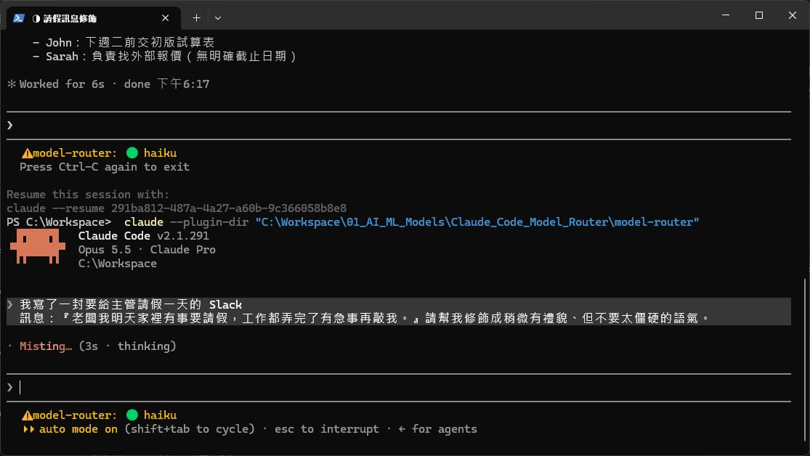
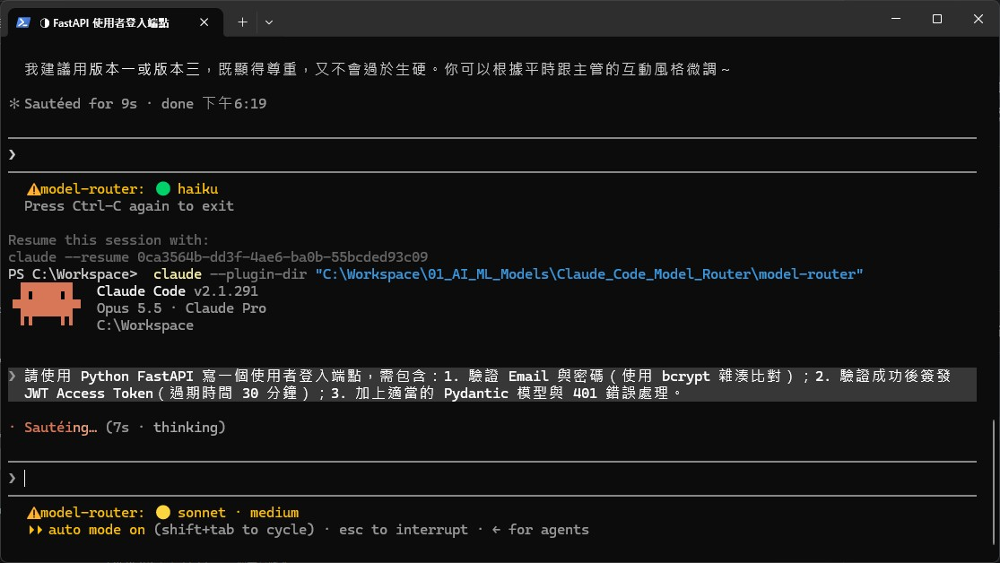
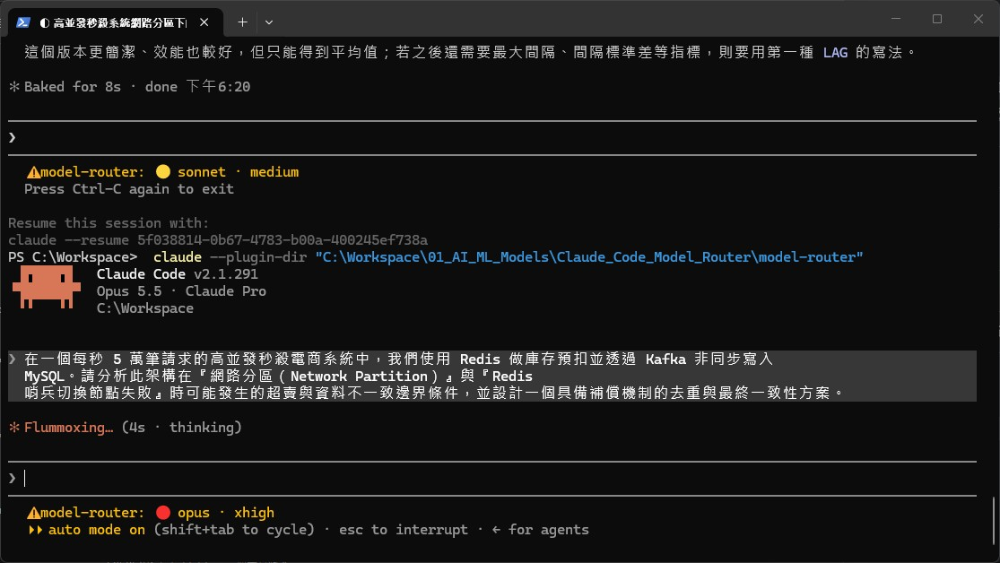

# model-router

**讓 Claude Code 依你的 prompt 自動挑選模型（Opus / Sonnet / Haiku）與 effort。**

簡單的潤稿用 Haiku，寫功能用 Sonnet，查疑難雜症用 Opus。你不用每次手動 `/model`。

[English](README.en.md) · [設計文件](docs/design.md) · [貢獻指南](CONTRIBUTING.md)

> ⚠️ **這是 Claude Code mod（外掛模組），使用的 mod API 目前是 Early Access，可能在版本之間改變。**
> 開發與實測版本：Claude Code **v2.1.291**。

---

## 實際效果

三張都是**全新 session**、預設模型是 Opus 5.5，第一句 prompt 送出後，狀態列就顯示 mod 選的模型與 effort。

| 🟢 簡單潤稿 → Haiku | 🟡 寫一支 API → Sonnet · medium | 🔴 分散式系統分析 → Opus · xhigh |
|:---:|:---:|:---:|
|  |  |  |
| 「我寫了一封要給主管請假一天的 Slack 訊息…請幫我修飾成稍微有禮貌、但不要太僵硬的語氣」 | 「請使用 Python FastAPI 寫一個使用者登入端點…bcrypt…JWT…401 錯誤處理」 | 「每秒 5 萬筆請求的高併發秒殺系統…網路分區與 Redis 哨兵切換失敗…設計具備補償機制的去重與最終一致性方案」 |
| 錯誤代價低、不動檔案 | 有既定框架、會經過測試 | 一致性邊界、資料不一致，出錯代價高 |

---

## 它怎麼運作

```
你送出 prompt
   │
   ├─ 該不該分類？
   │     ├─ 對話剛開始 / /clear / compact 後 / resume 載入舊對話   → 分類（可升可降）
   │     └─ 對話進行中                                              → 只在「明顯更難」時升級
   │
   ├─ 用 Haiku（effort: low）依 router prompt 分類，約 4 秒內沒回應就沿用目前路由
   │
   └─ 每次對 API 發請求前，把 model 與 effort 改寫成分類結果
```

| 層級 | 模型 | 預設 effort | 典型任務 |
|---|---|---|---|
| 🔴 TIER_1 | Opus 5.5 | `high`（疑難 / 安全 / 架構用 `xhigh`） | 根因不明的 debug、併發問題、安全審查、架構重構、合約審閱 |
| 🟡 TIER_2 | Sonnet 5.5 | `medium`（多步推導用 `high`） | 功能開發、補測試、資料分析腳本、技術文件、code review |
| 🟢 TIER_3 | Haiku 4.5 | 不帶 effort | 格式轉換、錯字修正、潤稿、摘要、單純問答（不動檔案、不跑指令） |

### 為什麼「對話中途只升不降」

Prompt cache 依模型分開。對話中途換模型，新模型要把整段 context 重新寫入 cache，**對話越長越貴**。
所以 mod 只在 cache 本來就要重建的時機（新對話、`/clear`、compact、resume）自由選模型；對話進行中只在「分類器信心 ≥ 0.8 且明顯更難」時升級，**從不自動降級**。

> Anthropic 官方價格倍率：5 分鐘 cache write 為基本輸入價的 **1.25×**，1 小時為 **2×**，cache read 為 **0.1×**（Opus 5.5 為 0.05×）。
> 詳見 [設計文件 §3](docs/design.md#3-路由時機與-cache-成本) 與 [Prompt caching 文件](https://platform.claude.com/docs/en/build-with-claude/prompt-caching)。

---

## 安裝

需要：Claude Code **v2.1.291 以上**（終端機版）。

### 方法 A：先試用，不安裝（已實測）

```powershell
git clone https://github.com/wetwilliam/model-router.git model-router-repo
claude --plugin-dir ".\model-router-repo\model-router"
```

只對這次啟動的 session 有效。

### 方法 B：從 marketplace 安裝（依官方文件，**尚未在本機實測**）

在 Claude Code 的提示列輸入：

```
/plugin install model-router --marketplace wetwilliam/model-router
```

依序會問：`Add marketplace?` → 輸入 `y`；選擇安裝範圍（user scope 為所有專案生效）；設定 `userConfig`（`midSession`）。
完成後顯示 `Installed model-router. Plugin is now active.`，不需重啟。

來源也可以是完整的 git URL（`https://github.com/wetwilliam/model-router.git`）或本機資料夾路徑。

### 確認有生效

啟動後狀態列會出現路由結果，例如 `🟡 sonnet · medium`。送出第一句 prompt 後會更新。

---

## 使用

### 狀態列

| 顯示 | 意思 |
|---|---|
| `🔴 opus · xhigh` / `🟡 sonnet · medium` / `🟢 haiku` | 目前自動選到的模型與 effort |
| `… 📌` | 你用 `/route` 鎖定了 |
| `🧭 手動 /model` | 你用 `/model` 手動換過，mod 不再干預 |

### 指令

| 指令 | 作用 |
|---|---|
| `/route opus [effort]` | 鎖定 Opus；effort 可選 `low` `medium` `high` `xhigh` `max`，預設 `medium` |
| `/route sonnet [effort]` | 鎖定 Sonnet |
| `/route haiku` | 鎖定 Haiku（不帶 effort） |
| `/route auto` | 解除鎖定，**下一句重新完整分類**（可升可降） |
| `/guard` | 顯示上下文守衛的門檻、設定值，以及最近 5 次評估結果（診斷用） |

> `max` 很貴，mod 不會自動選，要用請 `/route opus max` 或 `/effort max`。

### 上下文守衛（Context guard）

模型選對了，另一個大宗成本是**對話越拉越長**：每一輪都要重讀整段歷史。守衛會在你送出訊息前檢查兩件事，必要時跳出選項讓你決定，**不會自動清除或壓縮**。

| 觸發條件 | 跳出的選項 |
|---|---|
| 新訊息和先前對話**無關**（Haiku 判斷，信心 ≥ 0.8） | **是，清除** ／ **否，繼續** |
| Context **過大**（≥ 200k tokens 或視窗使用率 ≥ 50%） | **壓縮** ／ **清除** ／ **繼續** |
| 兩者同時成立 | **清除** ／ **壓縮** ／ **繼續**（同一個問題） |

- **清除**：執行 `/clear`，再把你原本的訊息原樣重送；router 會在新對話重新分類模型。
- **壓縮**：執行 compact，然後正常送出你的訊息。
- **繼續**：之後 context 再增加 10 個百分點或 50k tokens 才會再問，不會每句都問。
- 相關性偵測只在 context ≥ 8k tokens 且已有來回對話時才跑（context 太小時清除省不了什麼）。判斷不確定時一律當成「相關」，寧可多留也不誤清。
- 訊息帶 `@檔案` 或圖片時不提供「清除」（重送會遺失它們），只會問壓縮。
- 只攔你自己在終端機送出的訊息；斜線指令、外掛與背景任務送出的不會被攔。
- 偵測逾時、被你按 Esc、或任何錯誤，一律照常送出訊息。

在 `/config` 的 plugin 設定調整（留空即用預設）：

| 設定 | 預設 | 說明 |
|---|---|---|
| `guardTokens` | `200000` | context 絕對 tokens 門檻。1M 視窗的 50% 是 500k，太晚，所以用絕對值補強 |
| `guardPercent` | `50` | 視窗使用率門檻（%）；兩者任一達到就詢問 |
| `relevance` | `on` | `off` 可關閉相關性偵測，只保留「過大」提示，並省下每句一次的 Haiku 呼叫 |

> 若 `/guard` 顯示 `tokens=undefined`：引擎在「目前視窗的第一次回應」之前不提供用量，守衛會改用本地估算（`src=breakdown`）補上。

### 設定：`midSession`

在 `/config` 的 plugin 設定裡調整（修改後 mod 會自動重新載入）：

| 值 | 對話中途的行為 | 中途分類器呼叫 |
|---|---|---|
| `upgrade`（預設） | 信心 ≥ 0.8 且較難 → 自動升級，並跳通知 | 有（目前已是 Opus 時跳過） |
| `suggest` | 不切換，只跳通知「建議 `/route opus`」 | 有（目前已是 Opus 時跳過） |
| `off` | 中途完全不分類 | 無（最省） |

### 它**不會**動的東西

- 你用 `/model` 手動選的模型（直到 `/route auto`）
- Subagent 的模型（沿用它自己的設定）
- 分類失敗、逾時、解析錯誤時：沿用目前的路由，不會擋住你的 prompt

---

## 已知限制

- **Early Access API**：mod API 可能隨 Claude Code 更新而改變，更新後請跑 `npm run check`。
- **分類本身要花錢與時間**：每次分類是一次 Haiku 呼叫（輸入約 2–3k tokens、約 1–2 秒）。`midSession: off` 可大幅減少。
- **中途升級會重建一次 cache**，那一輪成本較高。
- **相關性偵測每句多一次 Haiku 呼叫**（輸入約 1k tokens，context ≥ 8k 才跑）。覺得干擾或太貴可設 `relevance: off`。
- **「清除」的重送不展開 `@檔案` 與圖片**，所以有附件時不提供清除。這個行為依型別定義實作，建議用 `/guard` 與實際操作確認。
- **還沒有 Jev 分類器**：設計文件評估過 TypeSafe 的 Jev（70–500 ms），但尚未實作。
- 完整清單見 [設計文件 §5](docs/design.md#5-已知限制)。

---

## 開發

```
.
├── .claude-plugin/marketplace.json   讓這個 repo 可被當 marketplace 安裝
├── model-router/                     ← mod 本體
│   ├── .claude-plugin/plugin.json
│   └── hooks/
│       ├── prompt.ts                 router prompt（要調分類規則改這裡）
│       ├── router.ts                 路由狀態機（純邏輯，不碰引擎，最容易測）
│       └── register.ts               把引擎事件接到狀態機
│   └── tests/router.test.ts
├── docs/                             設計文件、原始 prompt、截圖
└── package.json                      開發指令
```

```bash
npm run check    # validate + 型別檢查 + 測試，一次跑完
```

細節與調整 prompt 的流程見 [CONTRIBUTING.md](CONTRIBUTING.md)。

---

## 參考資源

**Claude Code 官方文件**
- [Hooks reference](https://code.claude.com/docs/en/hooks)：`UserPromptSubmit`、`PreModelSwitch` / `PostModelSwitch` 的欄位（傳統 hooks 無法改模型，這就是需要 mod 的原因）
- [Model configuration](https://code.claude.com/docs/en/model-config)：模型別名、`opusplan`、effort 等級、subagent 模型
- [Plugins overview](https://code.claude.com/docs/en/plugins) · [Create a plugin](https://code.claude.com/docs/en/plugins/create) · [Publish a plugin](https://code.claude.com/docs/en/plugins/publish)

**成本**
- [Prompt caching](https://platform.claude.com/docs/en/build-with-claude/prompt-caching)：cache 寫入 / 讀取倍率與失效規則

**其他模型路由做法**
- [claude-code-router](https://github.com/musistudio/claude-code-router)：本機 proxy，依請求類型分流，可接 DeepSeek、Gemini、Ollama 等
- [Pilot Shell：model routing](https://pilot-shell.com/docs/features/model-routing)：以 `opusplan` 為基礎的流程
- [功能請求 #44976：Auto model routing by task type](https://github.com/anthropics/claude-code/issues/44976)（已關閉為重複）
- [Claude Code’s New Model-Switch Hooks, Explained](https://jonathansblog.co.uk/?p=29790)

**分類器的替代選擇（尚未實作）**
- [What is Jev（DigitalOcean）](https://www.digitalocean.com/resources/articles/what-is-jev) · [Jev on OpenRouter](https://openrouter.ai/typesafe/jev-1.13/api)：TypeSafe 的低延遲 System One 分類模型

---

## 授權

[MIT](LICENSE)
